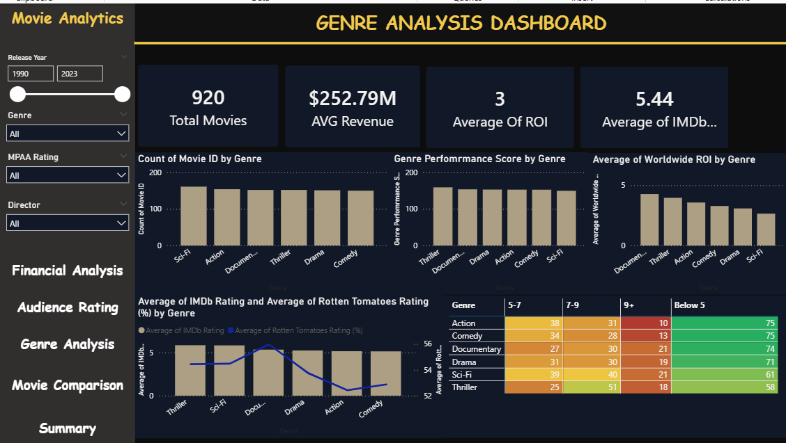

Entertainment Industry Trends & KPI Analysis — Power BI Dashboard
Project Overview

This project analyzes 920+ films and $232B+ revenue data to explore performance trends across genres, ratings, ROI patterns, and release-year behavior. The Power BI dashboard provides forecasting insights, KPI tracking, drill-through exploration, and audience segmentation to support content planning and data-driven decisions in the entertainment industry.

Technologies Used

Power BI · Power Query · DAX · Excel (data prep) · CSV Dataset

Project Structure

/Dataset — Source movie dataset used for analytics

/Dashboard.pbix — Main Power BI dashboard

/Insights Summary.docx— Key observations and business recommendations

Dashboard Preview___

How to open:

for dataset oen it in Excel

for dashboard open .pbix file in power file
